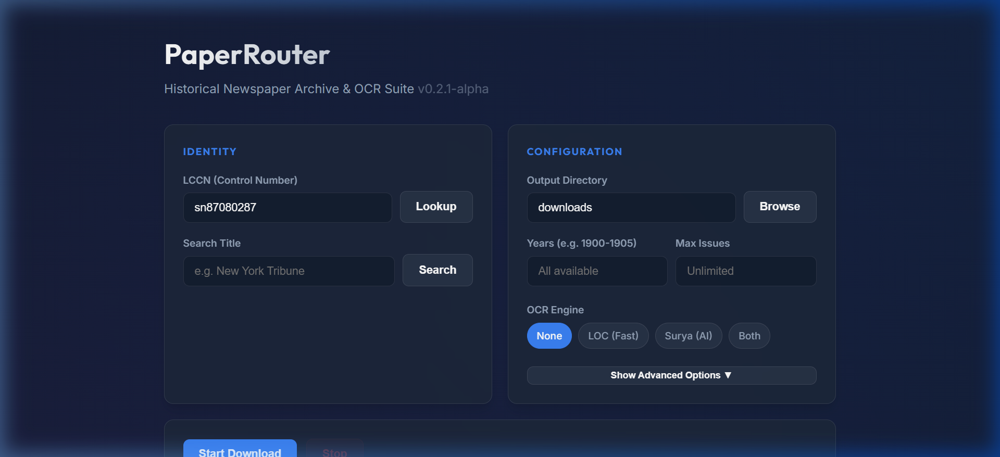
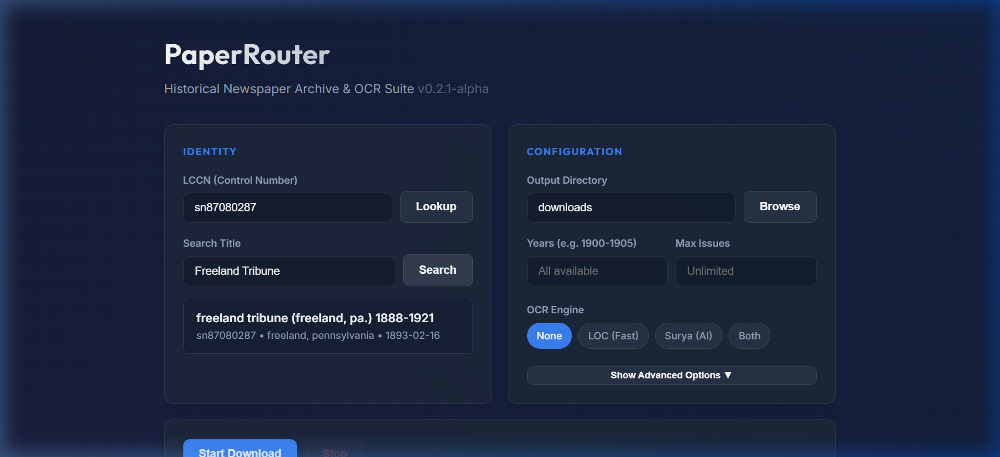
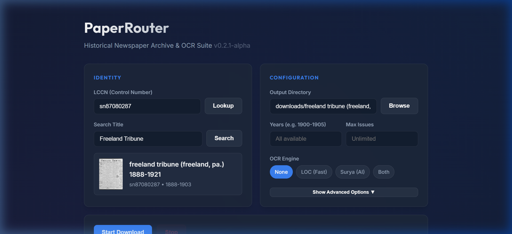
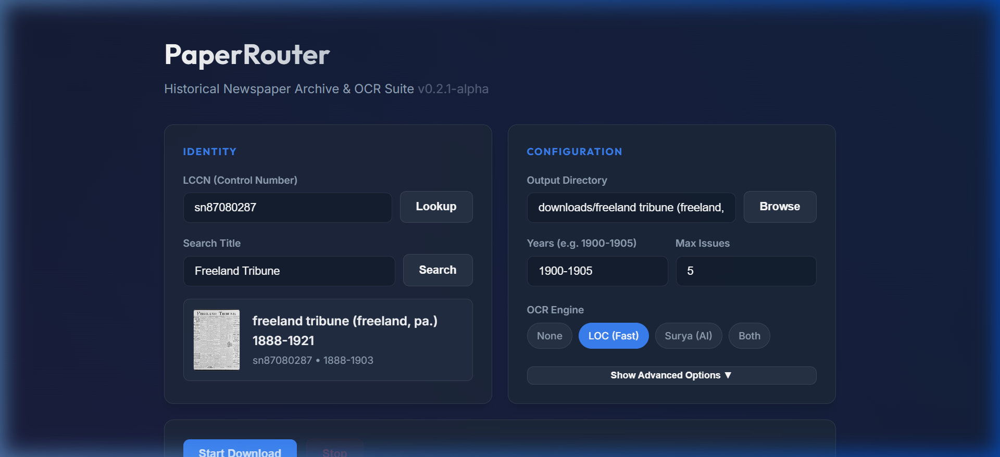
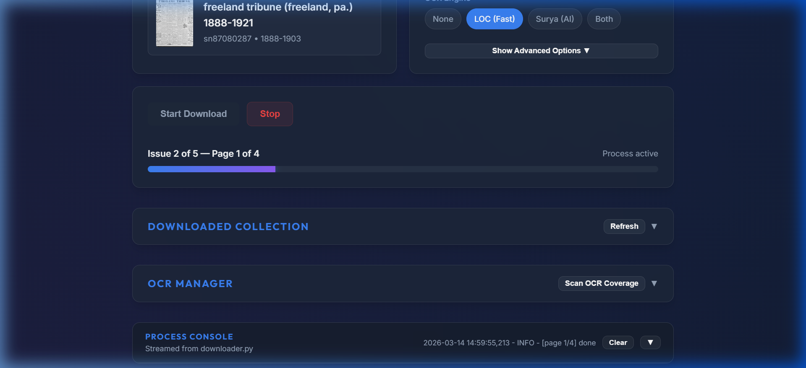

# PaperRouter

**v0.2.0-alpha** — This project is in early alpha. Features may change, and you may encounter bugs. Contributions, bug reports, and feedback are welcome.

> **Note:** This project is primarily AI-generated ("vibecoded"), with a strong emphasis on utilizing the technology to build a high-quality, robust tool.
>
> *Please also note that the screenshots in this README are currently out of date and will be updated in the future.*

A Python tool for downloading and extracting text from historical newspaper archives. Currently supports the **Library of Congress [Chronicling America](https://chroniclingamerica.loc.gov/)** collection — millions of pages of American newspapers, free and in the public domain.

PaperRouter gives you one PDF per page and can optionally extract the printed text using OCR (see [What is OCR?](#what-is-ocr) below).



---

## Table of Contents

- [Prerequisites](#prerequisites)
- [Installation](#installation)
- [Getting Started — Web Interface](#getting-started--web-interface)
- [Getting Started — Command Line](#getting-started--command-line)
- [What is OCR?](#what-is-ocr)
- [OCR Options Explained](#ocr-options-explained)
- [Output Structure](#output-structure)
- [CLI Reference](#cli-reference)
- [Rate Limiting](#rate-limiting)
- [Memory-Protected AI OCR (Harness)](#memory-protected-ai-ocr-harness)
- [FAQ & Troubleshooting](#faq--troubleshooting)
- [Developer Guide](#developer-guide)
- [Versioning](#versioning)
- [License & Credits](#license--credits)

---

## Prerequisites

You need **Python 3.10 or newer** installed on your computer.

<details>
<summary>Don't have Python? Click here for installation steps.</summary>

1. Go to https://www.python.org/downloads/
2. Click the big **Download Python** button.
3. Run the installer.
4. **Check the box that says "Add Python to PATH"** — this is important.
5. Click **Install Now**.
6. Restart your computer after installation.

To verify, open a terminal (Command Prompt on Windows) and type:
```
python --version
```
You should see something like `Python 3.12.0`.
</details>

## Installation

**Recommended (Windows):** Double-click **`start.bat`**. It creates a virtual environment, installs dependencies, checks for updates, and launches the web interface — all in one click.

**Manual setup:**
```bash
pip install -r requirements.txt
```

This installs `requests`, `flask`, and `psutil`. An optional package, `rich`, provides enhanced CLI table formatting — install it with `pip install rich` if you want prettier command-line output.

**With AI OCR** (local text extraction using Surya — see [OCR Options Explained](#ocr-options-explained)):
```bash
pip install -r requirements.txt surya-ocr pymupdf torch Pillow
```

> **Note:** `start.bat` manages a `.venv/` virtual environment automatically. The older `run_gui.bat` and `run.bat` launchers still work and will use the `.venv` if present, or fall back to system Python.

---

## Getting Started — Web Interface

The web interface is the recommended way to use PaperRouter, especially if you prefer not to use the command line.

### Step 1: Launch the app

```bash
python web_gui.py
```

Or on Windows, double-click **`start.bat`** (recommended) or **`run_gui.bat`**. Your default browser will open automatically. The server picks the first available port (starting from 5000) — the actual URL is printed in the terminal.

### Step 2: Find your newspaper

Every newspaper in the archive has a unique identifier called an **LCCN** (Library of Congress Control Number), such as `sn87080287`.

The left-hand **Identity** card is where you find and select your newspaper:

- **If you know the LCCN:** Type it in the LCCN field and click **Lookup**.
- **If you don't know it:** Type a name in the **Search Title** field (e.g. "Freeland Tribune") and click **Search**. Click a result to select it.



Once a newspaper is found, a **preview card** appears below the search fields showing the title, LCCN, date range, and a thumbnail of the first page (when available).



Here are some example LCCNs to try:

| LCCN | Newspaper |
|---|---|
| `sn87080287` | Freeland Tribune (Freeland, PA) |
| `sn83045462` | Evening Star (Washington, DC) |
| `sn83030214` | New-York Tribune (New York, NY) |

You can also browse the full collection at https://chroniclingamerica.loc.gov/.

### Step 3: Choose your options

The right-hand **Configuration** card controls how downloads work:



| Option | What it does |
|---|---|
| **Output Directory** | Where files get saved. Both the GUI and CLI default to a subfolder under `downloads/`. The web GUI names it after the newspaper title (e.g. `downloads/freeland tribune`), while the CLI uses the LCCN (e.g. `downloads/sn87080287`). Your choice is remembered across sessions. You can always set your own path. |
| **Years** | Leave blank for all available years, or enter a range like `1900-1905` or `1900,1903,1910-1915`. |
| **Max Issues** | Limit how many issues to download. Leave blank for unlimited. Useful for testing with a small batch first. |
| **OCR Engine** | Text extraction mode. Select a chip: **None**, **LOC (Fast)**, **Surya (AI)**, or **Both**. See [OCR Options Explained](#ocr-options-explained). |
| **Speed Profile** | **Safe (15s)** is recommended. See [Rate Limiting](#rate-limiting). |
| **Verbose Log** | Show detailed debug output in the process console. |
| **Retry Failed** | Re-attempt pages that failed on a previous run. |

### Step 4: Download

Click **Start Download** and watch the progress bar and process console.



- Downloads are intentionally paced (15-second delay on Safe) to respect the Library of Congress servers.
- Click **Stop** at any time. Your progress is saved automatically, and you can resume later by clicking Start Download again — already-downloaded pages are skipped.
- The **Retroactive OCR** button runs OCR on files you have already downloaded, without re-downloading them (see [Retroactive OCR](#retroactive-ocr-batch-mode)).

### Step 5: Find your files

Open the output folder. Inside you'll find year sub-folders containing the PDFs:

```
downloads/sn87080287/          # CLI default (uses LCCN)
  — or —
downloads/freeland tribune/    # Web GUI default (uses title)
├── 1900/
│   ├── sn87080287_1900-01-04_ed-1_page01.pdf
│   ├── sn87080287_1900-01-04_ed-1_page02.pdf
│   └── ...
├── 1901/
│   └── ...
```

The file naming convention is: `{lccn}_{date}_ed-{edition}_page{NN}.pdf`

---

## Getting Started — Command Line

If you prefer the terminal or want to automate downloads:

### Search for a newspaper

```bash
python downloader.py --search "Freeland Tribune"
```

Output:
```
Search results for 'Freeland Tribune' (loc):
  sn87080287: Freeland tribune (Freeland, Pa., 1893-19??)
```

Add `--json` for machine-readable output.

### Get newspaper details

```bash
python downloader.py --info sn87080287
```

Output:
```
Newspaper: Freeland tribune.
LCCN:      sn87080287
Range:     1893-1918
URL:       https://www.loc.gov/resource/...
```

### Download

```bash
# Download all available issues
python downloader.py --lccn sn87080287

# Download only specific years
python downloader.py --lccn sn87080287 --years 1900-1905

# Download a single test issue first
python downloader.py --lccn sn87080287 --max-issues 1
```

### Add OCR text extraction

```bash
# LOC OCR: download pre-existing text from the archive (fast)
python downloader.py --lccn sn87080287 --ocr loc

# Surya OCR: run local AI text extraction (slow, higher quality)
python downloader.py --lccn sn87080287 --ocr surya

# Both tiers
python downloader.py --lccn sn87080287 --ocr both

# Run OCR on already-downloaded PDFs (retroactive)
python downloader.py --lccn sn87080287 --ocr loc --ocr-batch
```

---

## What is OCR?

**OCR** stands for **Optical Character Recognition**. It is the process of reading printed text from scanned images — in this case, photographs of old newspaper pages — and converting it into digital text you can search, copy, and paste.

Without OCR, you only get the scanned page images (PDFs). With OCR, you also get `.txt` files containing the extracted words from each page.

OCR on historical newspapers is inherently imperfect. Faded ink, unusual typefaces, damaged pages, and tight column layouts all reduce accuracy. The extracted text is useful for searching and getting the gist of an article, but expect some errors.

---

## OCR Options Explained

PaperRouter offers two OCR methods. You can use either, both, or neither.

### LOC OCR (fast, no extra software needed)

The **Library of Congress** has already run OCR on most pages in the Chronicling America collection. Selecting **LOC** downloads this pre-existing text directly from the archive's servers.

- **Speed:** Fast — just a small text download per page.
- **Quality:** Varies. The LOC processed these pages in bulk, so some are excellent and others are garbled, especially on older or damaged pages.
- **Requirements:** None beyond the base install.
- **Output files:** `*_loc.txt` alongside each PDF.
- **GUI option:** Select the **LOC (Fast)** chip under OCR Engine.
- **CLI flag:** `--ocr loc`

### Surya OCR (slow, higher quality, runs locally)

**Surya** is an open-source AI model that runs on your own computer to read text from the scanned images. It often produces better results than the LOC text, especially on difficult pages.

- **Speed:** Slow — each page requires AI inference. Expect minutes per page depending on your hardware.
- **Quality:** Generally higher than LOC, particularly on challenging scans.
- **Requirements:** Extra packages: `pip install surya-ocr pymupdf torch Pillow`. A modern GPU helps but is not required (CPU mode is much slower).
- **Resource usage:** Surya loads large AI models into memory. PaperRouter includes a [memory-protection harness](#memory-protected-ai-ocr-harness) that monitors RAM usage and terminates the process if your system runs low.
- **Output files:** `*_surya.txt` alongside each PDF.
- **GUI option:** Select the **Surya (AI)** chip under OCR Engine.
- **CLI flag:** `--ocr surya`

### Both

Runs LOC first, then Surya. You get two text files per page (`_loc.txt` and `_surya.txt`) so you can compare quality.

- **GUI option:** Select the **Both** chip under OCR Engine.
- **CLI flag:** `--ocr both`

### None (default)

Downloads PDF page scans only, with no text extraction.

### Retroactive OCR (batch mode)

Already downloaded a newspaper but want to add text extraction later? Use batch mode:

- **GUI:** Select an OCR engine chip, then click the **Retroactive OCR** button.
- **CLI:** `python downloader.py --lccn sn87080287 --ocr loc --ocr-batch`

This scans your existing download folder and runs OCR on every page that doesn't already have a text file.

**Force re-run:** Check the "Force re-run" box (GUI) or add `--force-ocr` (CLI) to overwrite existing OCR text files — useful when you want to re-process pages with a different engine.

**Target a single issue:** Add `--date 1900-05-15` (CLI) to process only one issue instead of the entire collection. In the GUI, use the OCR Manager's "Specific date" field.

### OCR Manager (Web GUI)

Below the Controls card, the web interface shows two panels once you have downloaded content:

- **Downloaded Collection** — A read-only summary showing the title, year range, issue count, and page count for everything in your output directory. Refreshes automatically after each download.
- **OCR Manager** — Click "Scan OCR Coverage" to see per-year OCR completion percentages for both LOC and Surya engines. You can then select specific years, optionally target a single date, and run OCR on just the selected content. The "Select Missing" button auto-checks years that have incomplete OCR for the chosen engine.

---

## Output Structure

```
downloads/sn87080287/
├── download_metadata.json        # Tracks all downloaded/failed issues
├── download.log                  # Session log
├── 1900/
│   ├── sn87080287_1900-01-04_ed-1_page01.pdf
│   ├── sn87080287_1900-01-04_ed-1_page02.pdf
│   ├── sn87080287_1900-01-04_ed-1_page01_loc.txt    # LOC OCR text
│   ├── sn87080287_1900-01-04_ed-1_page01_surya.txt  # Surya OCR text
│   └── ...
├── 1901/
│   └── ...
```

**OCR text files** include a header with metadata (LCCN, date, page number, OCR method) followed by the extracted text.

### Resume behavior

The `download_metadata.json` file tracks every successfully downloaded issue. If you stop and restart, previously completed issues are automatically skipped. Use `--retry-failed` (or check "Retry Failed" in the GUI) to re-attempt issues that had errors.

---

## CLI Reference

```
usage: downloader.py [-h] [--lccn LCCN] [--source SOURCE] [--years YEARS]
                     [--output OUTPUT] [--search SEARCH] [--info INFO]
                     [--ocr {none,loc,surya,both}] [--max-issues MAX_ISSUES]
                     [--retry-failed] [--verbose] [--speed {safe,standard}]
                     [--ocr-batch] [--json]
```

| Flag | Description |
|---|---|
| `--lccn LCCN` | Newspaper LCCN identifier (e.g. `sn87080287`) |
| `--source SOURCE` | Archive source to use (default: `loc`) |
| `--search QUERY` | Search for newspapers by title |
| `--info LCCN` | Show details about a specific newspaper |
| `--years YEARS` | Filter by year range: `1900-1905`, `1900,1903`, or `1893,1895-1900` |
| `--output DIR` | Output directory (default: `downloads/<lccn>`, e.g. `downloads/sn87080287`) |
| `--ocr MODE` | OCR mode: `none` (default), `loc` (archive text), `surya` (local AI), `both` |
| `--ocr-batch` | Run OCR on already-downloaded files |
| `--max-issues N` | Limit number of issues to process (`0` = all) |
| `--speed PROFILE` | Download speed: `safe` (15s delay, default) or `standard` (4s delay) |
| `--retry-failed` | Re-download previously failed pages |
| `--force-ocr` | Overwrite existing OCR text files (use with `--ocr-batch`) |
| `--date YYYY-MM-DD` | Target a single issue date for `--ocr-batch` (e.g. `1900-05-15`) |
| `--verbose` | Enable detailed debug logging |
| `--json` | Machine-readable JSON output (for `--search` and `--info`) |

---

## Rate Limiting

PaperRouter respects the Library of Congress API rate limits:

| Profile | Delay Between Downloads | Approx. Throughput |
|---|---|---|
| `safe` (default) | 15 seconds | ~4 requests/min |
| `standard` | 4 seconds | ~15 requests/min |

The LOC enforces a burst limit of 20 requests per minute (5-minute block on violation) and a crawl limit of 20 requests per 10 seconds (1-hour block). The `safe` profile stays well under both limits. Use `standard` at your own risk for large batch jobs.

All requests include automatic retry with exponential backoff for transient errors (429, 5xx).

---

## Memory-Protected AI OCR (Harness)

Surya AI OCR loads large machine-learning models into memory. When you select Surya or Both OCR mode, PaperRouter can route the work through `harness.py` — a process wrapper that monitors resource usage.

The harness will terminate the OCR process if:
- Memory exceeds **75% of available RAM** (configurable via `HARNESS_MEM_MB` environment variable)
- Runtime exceeds **120 minutes** (configurable via `HARNESS_TIMEOUT` environment variable)

To kill a running harness from another terminal:
```bash
python harness.py --kill
```

The web interface uses the harness automatically whenever Surya OCR is active.

---

## FAQ & Troubleshooting

<details>
<summary><strong>Why is it so slow?</strong></summary>

The 15-second delay between downloads is intentional. The Library of Congress will temporarily block your IP if you make too many requests too quickly. The "Safe" speed keeps you well under their limits.
</details>

<details>
<summary><strong>Can I stop and come back later?</strong></summary>

Yes. PaperRouter saves your progress automatically. Run the same command again (or click Start Download in the GUI) and it will skip everything already downloaded. You will never download the same page twice.
</details>

<details>
<summary><strong>Some pages failed. What do I do?</strong></summary>

Run the download again with "Retry Failed" checked in the GUI, or add `--retry-failed` on the command line. PaperRouter remembers which pages had errors and will try those again.
</details>

<details>
<summary><strong>I got blocked / "429 Too Many Requests"</strong></summary>

PaperRouter handles this automatically with retries and backoff. If it keeps happening, wait a few minutes and try again. Make sure you are using the "Safe" speed profile.
</details>

<details>
<summary><strong>How much disk space do I need?</strong></summary>

It depends on the newspaper. Each page is typically 100–500 KB as a PDF. A newspaper with 4 pages per issue, published weekly for 20 years, would be roughly 1,000 issues x 4 pages x 300 KB = about **1.2 GB**.
</details>

<details>
<summary><strong>Where do I find more newspapers?</strong></summary>

Browse the full Chronicling America collection at https://chroniclingamerica.loc.gov/. Use the "Search Pages" or "All Digitized Newspapers" links. The LCCN is shown on each newspaper's page.
</details>

<details>
<summary><strong>The OCR text looks garbled</strong></summary>

OCR on old newspapers is inherently imperfect — faded ink, unusual fonts, and damaged pages all reduce quality. Try **Surya** OCR for potentially better results, or use the LOC text as a rough guide.
</details>

<details>
<summary><strong>Can I download from archives other than the Library of Congress?</strong></summary>

PaperRouter's architecture supports multiple sources, but currently only the Library of Congress is implemented. See the [Developer Guide](DEVELOPER_GUIDE.md) if you'd like to add another archive.
</details>

<details>
<summary><strong>"python" is not recognized as a command</strong></summary>

Python isn't installed, or wasn't added to PATH. Reinstall Python and make sure to check **"Add Python to PATH"** during setup.
</details>

<details>
<summary><strong>"No module named 'requests'"</strong></summary>

Open a terminal and run `pip install -r requirements.txt`. Or use `run.bat` / `run_gui.bat` — they install dependencies for you.
</details>

<details>
<summary><strong>The web interface doesn't open in the browser</strong></summary>

1. Try running `python web_gui.py` from a terminal to see error messages and the URL it binds to.
2. The server tries ports 5000, 5001, 8080, and others in sequence — check the terminal output for the actual URL.
3. Make sure Flask is installed: `pip install flask`
</details>

<details>
<summary><strong>"Failed to import Surya" when using AI OCR</strong></summary>

Install the extra dependencies: `pip install surya-ocr pymupdf torch Pillow`. Surya requires a modern GPU for best performance but will run (slowly) on CPU.
</details>

<details>
<summary><strong>Crash or freeze during Surya OCR</strong></summary>

Surya uses a lot of memory. The harness is supposed to prevent this, but if it happens:
1. Restart the script — progress is saved, nothing is lost.
2. Try setting a lower memory limit: `set HARNESS_MEM_MB=4000` (Windows) or `export HARNESS_MEM_MB=4000` (Mac/Linux) before running the command.
3. Consider using LOC OCR instead — it's much lighter.
</details>

---

## Windows Batch Launchers

| File | Description |
|---|---|
| `start.bat` | **Recommended.** Creates a virtual environment, installs dependencies, checks for updates, and launches the web GUI. |
| `run_gui.bat` | Web GUI launcher (legacy). Uses the `.venv` if present, falls back to system Python. |
| `run.bat` | CLI launcher (legacy). Same venv detection, passes arguments to `downloader.py`. |

All scripts auto-install required dependencies (`requests`, `flask`, `psutil`) if missing.

---

## Auto-Update

PaperRouter can check for new releases on GitHub and update itself without requiring Git.

### How it works

1. On launch, `start.bat` runs `updater.py --check-only` to check the [GitHub Releases API](https://docs.github.com/en/repositories/releasing-projects-on-github/about-releases) for a newer version.
2. If an update is found, the terminal prints a notice. In the web GUI, a purple banner appears at the top of the page.
3. Click **Update Now** in the banner (or run `python updater.py --apply` from the command line) to download and apply the update. PaperRouter downloads the release zipball, extracts it, and copies the new files over your installation — preserving your `downloads/`, `.venv/`, and other user data.
4. After updating, restart the application to use the new version.

### Updater CLI

```bash
# Check for updates (human-readable)
python updater.py --check-only

# Check for updates (JSON output)
python updater.py --check-only --json

# Download and apply the latest release
python updater.py --apply
```

### For maintainers — creating a release

Tag a new version and create a GitHub release:

```bash
git tag v0.3.0
git push origin v0.3.0
gh release create v0.3.0 --title "v0.3.0" --notes "Release notes here"
```

GitHub automatically generates a source zipball for each release. The updater downloads this zipball — no manual asset uploads are needed.

---

## How It Works

PaperRouter uses a **pluggable source architecture** to decouple download logic from archive-specific APIs:

1. **Selection** — The `DownloadManager` initializes a source engine (e.g. `LOCSource`) based on `--source`.
2. **Discovery** — The source queries the archive API with year filtering to build an issue list.
3. **Procurement** — Pages are fetched as high-quality, sequentially-named PDFs organized by year.
4. **Enrichment** — OCR text is extracted using the selected tier. Surya OCR runs in a monitored process harness to protect system memory.
5. **Tracking** — Each completed issue is recorded in `download_metadata.json` for resume support.

---

## Developer Guide

Want to add a new archive source or contribute to the OCR pipeline? See [DEVELOPER_GUIDE.md](DEVELOPER_GUIDE.md).

---

## Versioning

PaperRouter follows [Semantic Versioning](https://semver.org/) (SemVer):

```
MAJOR.MINOR.PATCH[-prerelease]
```

- **MAJOR** — Breaking changes to CLI flags, output format, or source plugin API.
- **MINOR** — New features (new sources, new OCR engines, GUI improvements).
- **PATCH** — Bug fixes and minor improvements.
- **Pre-release tags** — `alpha` (early development, expect rough edges), `beta` (feature-complete, stabilizing), `rc` (release candidate).

The current version is in the [VERSION](VERSION) file.

---

## License & Credits

[MIT](LICENSE). Built for educational and historical research.

Newspapers in the Chronicling America collection are provided by the **Library of Congress** and the **National Endowment for the Humanities** and are generally in the public domain.
